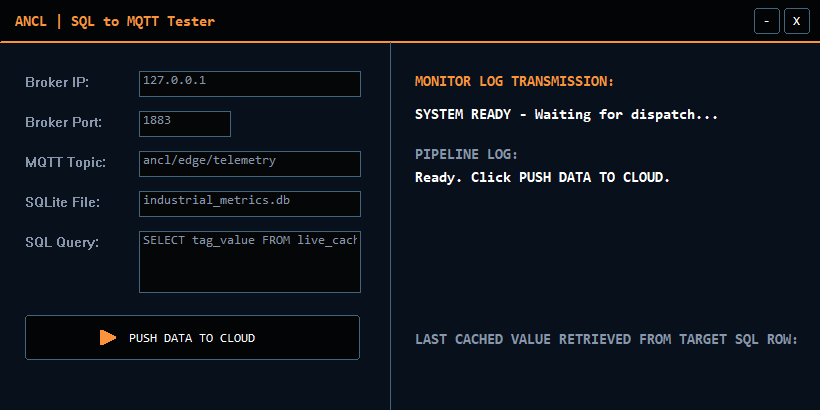

# ANCL SQL-to-MQTT Tester

A zero-dependency, native Win32 edge gateway written entirely in ANCL: read a value from a SQLite
database and publish it to an MQTT broker from a compact configurable GUI.



## What It Does
1. Configure Broker IP, Broker Port, MQTT Topic, SQLite file, SQL Query, and optional TLS fields in the UI.
2. Click PUSH DATA TO CLOUD.
3. The app opens the SQLite DB, runs your query, takes the first column of the first row, and
   publishes it to `<Broker IP>:<Broker Port>`.
4. The right-hand panel shows live status and the last value retrieved. If the query returns no row,
   it falls back to a mock value so the pipeline still demonstrates end-to-end.

## Highlights
- Native Win32 + GDI, hand-rolled in ANCL with a custom draggable title bar.
- Minimize and close buttons in the app chrome.
- Owner-drawn GlowButton control with hover, press, and neon-accent states.
- Raw MQTT packet construction, including proper MQTT variable-length Remaining Length encoding.
- Direct `sqlite3` C API calls via `sqlite3_prepare_v2` and `sqlite3_step`.
- Live, editable configuration: every field, including broker port, is read at dispatch time.
- Optional TLS publishing through the installed Mosquitto CLI for realistic cloud broker tests.

## Build
From the repository root:

```powershell
bin\anclc.exe showcase\sqltomqtt\src\sql_to_mqtt.ancl showcase\sqltomqtt\bin\sql_to_mqtt.exe
```

## Run-Time Dependencies
- `sqlite3.dll`: keep it next to `sql_to_mqtt.exe` or anywhere on the DLL search path.
- `ws2_32.dll`, `user32.dll`, `gdi32.dll`, and `kernel32.dll`: included with Windows.
- TLS mode uses `C:\Program Files\mosquitto\mosquitto_pub.exe`.

## Usage Notes
- Default form points at local Mosquitto (`127.0.0.1`) on port `1883`, topic
  `ancl/edge/telemetry`, DB `industrial_metrics.db`.
- Keep `TLS (0/1)` as `0` for plain local MQTT on port `1883`.
- Set `TLS (0/1)` to `1` for a TLS/cloud broker. If `CA File` is blank, Mosquitto uses the
  Windows OS certificate store. Fill `CA File` when the broker requires a specific CA PEM file.
- Username and Password are optional and are passed through to the broker only when filled.
- Subscribe to verify, for example:

```powershell
mosquitto_sub -h test.mosquitto.org -t ancl/edge/telemetry
```

- Publishes QoS 0; the value sent is the first column returned by your query.

## Local Test Setup
Use `127.0.0.1` with port `1883` to test against a local Mosquitto broker. Keep
`industrial_metrics.db` next to `bin\sql_to_mqtt.exe` if using the default DB path.

After installing Mosquitto and SQLite, the local helper scripts are:

```powershell
powershell -ExecutionPolicy Bypass -File showcase\sqltomqtt\localtest\reset_local_db.ps1
powershell -ExecutionPolicy Bypass -File showcase\sqltomqtt\localtest\listen_local.ps1
powershell -ExecutionPolicy Bypass -File showcase\sqltomqtt\localtest\open_tester.ps1
```

Run `listen_local.ps1` in one terminal, open the tester in another, then click
`PUSH DATA TO CLOUD`. The subscriber should print:

```text
ancl/edge/telemetry LOCAL_TEST_OK
```

## Live Dashboard Demo
For a fuller local demo, run:

```powershell
powershell -ExecutionPolicy Bypass -File showcase\sqltomqtt\localtest\live_dashboard.ps1
```

This starts a local data generator, writes changing values into SQLite, publishes them to Mosquitto
on `ancl/edge/live`, and opens a dashboard at:

```text
http://127.0.0.1:8765/
```

The dashboard shows the latest value read from SQLite and the latest value received from MQTT side
by side. Keep the PowerShell window open while using it; press `Ctrl+C` to stop.

The dashboard can also watch a real SQLite database and broker instead of generating local demo
data:

```powershell
powershell -ExecutionPolicy Bypass -File showcase\sqltomqtt\localtest\live_dashboard.ps1 `
  -NoGenerator `
  -SqlDb "C:\path\to\your.db" `
  -SqlQuery "SELECT ts,tag_value,status,temp,pressure,vibration FROM live_cache LIMIT 1;" `
  -MqttHost "your-broker.example.com" `
  -MqttPort 8883 `
  -MqttTopic "ancl/edge/#" `
  -MqttTls `
  -MqttUser "username" `
  -MqttPassword "password"
```

Use `-MqttCaFile "C:\path\to\ca.pem"` if the broker uses a private CA. Omit `-MqttTls`,
`-MqttUser`, and `-MqttPassword` for an unauthenticated local broker.

## Status Field Meanings
| Status | Meaning |
|---|---|
| SYSTEM READY | Idle, waiting for dispatch |
| PROCESSING | Reading DB and building frames |
| SUCCESS | Telemetry published to the broker |
| ERROR (db / network / broker) | The failed stage: DB open, socket init, or broker connect |
